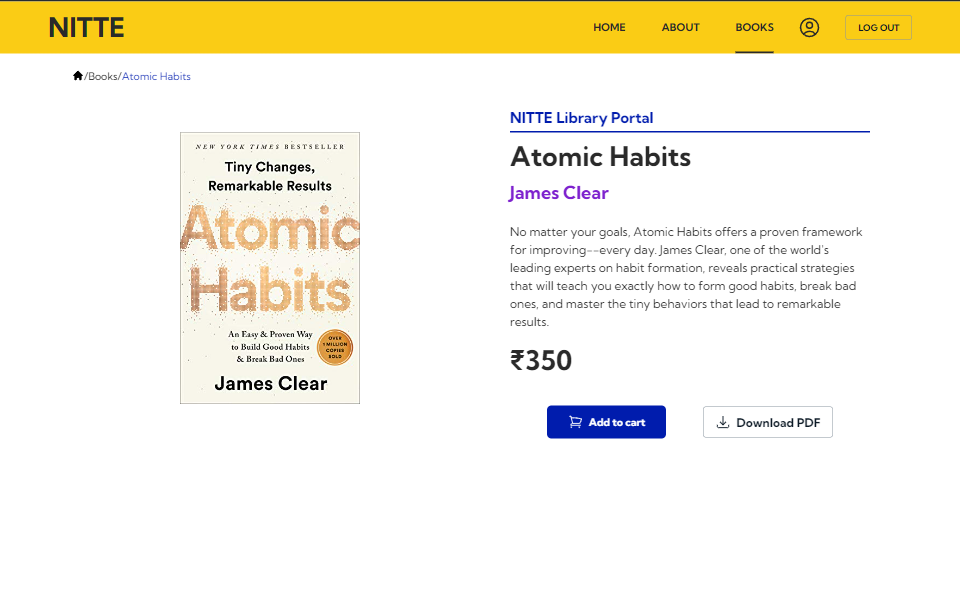
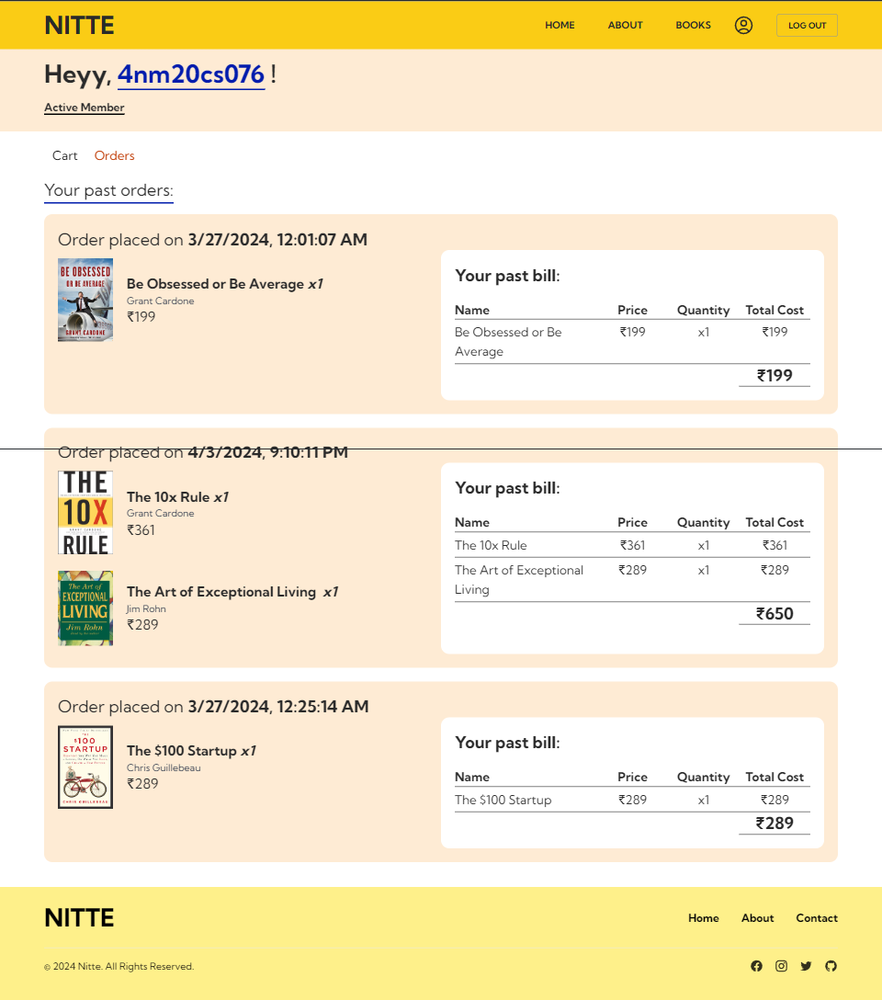

# Serverless Library Portal

In the landscape of traditional library management systems, challenges like complex infrastructure management, scaling limitations, and high operational costs persist. The Library Serverless Portal revolutionizes this with AWS serverless technologies. Unlike manual resource provisioning, AWS's serverless architecture offers automated scaling, optimizing costs and simplifying maintenance.

## System Design

The system utilizes AWS services to operate an online book store, employing a pipeline resolver architecture for transaction coordination:

- **Front-end:** React web application hosted on AWS Amplify for browsing catalogs and placing orders.
- **AWS AppSync:** Real-time GraphQL API facilitating frontend-backend communication.
- **DynamoDB:** Scalable NoSQL database storing catalogs, carts, and order history.
- **Cognito:** Managed service for user authentication and authorization.
- **Stripe:** Payment processor integrated with the API for secure transactions.
- **Lambda:** Serverless compute service for scaling API endpoints based on demand.

## Features

- Secure sign-up, sign-in, and profile management
- Store and retrieve book images and PDFs
- Facilitate order placement, payment, and fulfillment
- Track order status and history
- Manage user carts for adding, removing, and modifying items
- Secure payment transactions for purchases and subscriptions
- Verify payment success and update order status
- Utilize AWS services for authentication, storage, computation, and API management
- Integrate Stripe for payments
- Provide a seamless browsing and purchasing experience
## Screenshots

## Authors

- [Github](https://www.github.com/harshithrao07)
- [Linkedin](https://www.linkedin.com/in/harshithrao07/)
- [Portfolio](https://harshithrao.vercel.app/)
- [Instagram](https://www.instagram.com/harshith._.rao/)

